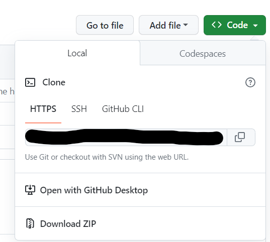

# PandaTutorial


This tutorial is made with the help of DataBricks. So for personal local use, you have to change the path address of the file according to you.


This you need to do while learning 
- Download Jupyter Notebook so that you can edit and work with code in that
- Fork [Project](https://github.com/shahiakhilesh1304/PandaTutorial.git) into your repository.
- Clone into your local directory
    - click on the code in your repository. and code the path
        
        ```
          git clone <link_to_your_project_in_your_repository>
        ```
      - Create a branch
        ```
          git checkout -b <branch_name>
        ```
      - Now import the code in jupyter notebook and edit the paths accordingly
- If you make any changes push them into your personal repository and create a pull request (Only add the changes that are required)
  ```
  git status
  git add <file_name>
  git commit -m "Your message as in what changes you have made"
  git push --set-upstream origin <your_branch>
  ```
- After pushing it to the repository create a pull request


EVERYONE IS WELCOME TO MAKE SUGGESTIONS AND PROVIDE THEIR INPUT.
YOU CAN CONTRIBUTE TO THIS REPOSITORY WITH MORE IDEAS AND CASE STUDIES.
###NOTE:-
**ADD YOU CASE STUDY IN A CASE STUDY FOLDER WITH A NAME OF THE CASE STUDY AS A FOLDER AND KEEP IT REQUIREMENT IN SUBFOLDER NAMEING Requirements IN SUBFODLER OF Requirements CREATE A FOLDER DataSet ADD YOUR DATA SET INTO THAT. Also, Edit the Changes in this file and add your Folder Name to this readme.md file following with the link as below**

```
  ###YOUR CASE STUDY NAME
      - [Requirement](Link to your requirement folder)
      - [Data Set](Link to your Data set)
      - [Code](Link to your code base)
```


